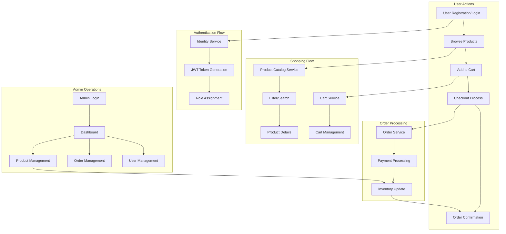
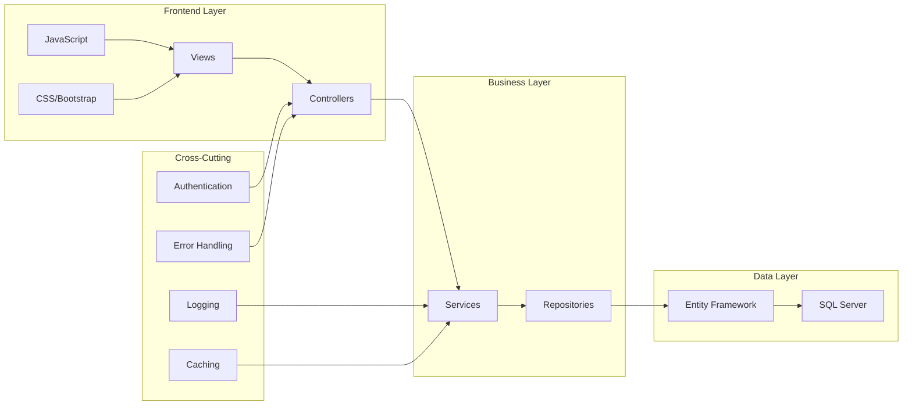
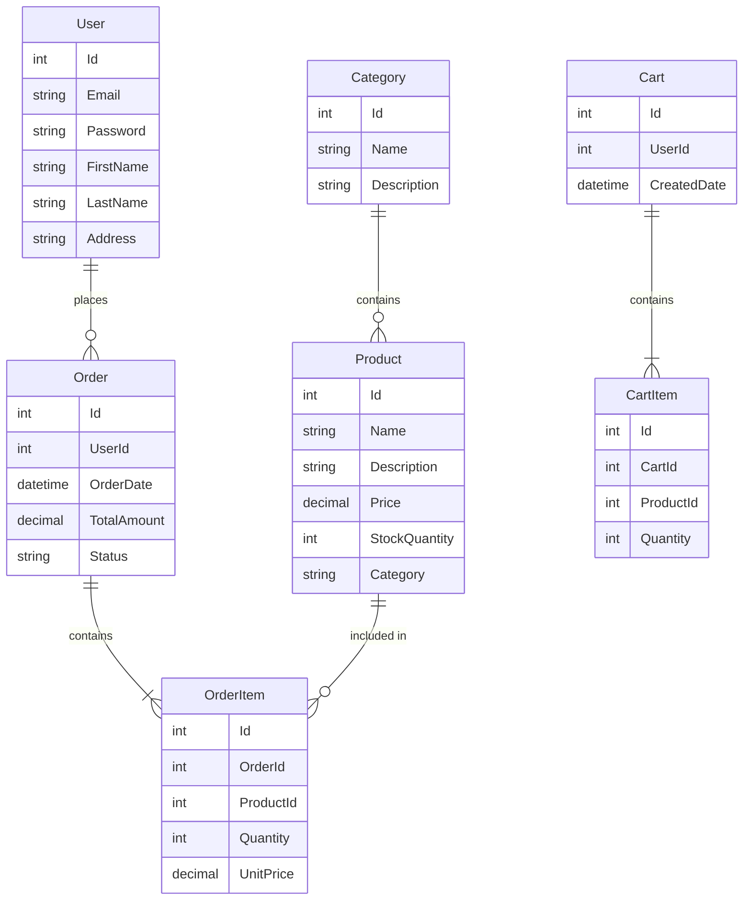

# BestStore MVC

A modern e-commerce web application built with ASP.NET Core MVC, providing a robust and scalable solution for online retail businesses.

## ✨ Features

- User Authentication and Authorization
- Product Management
- Shopping Cart Functionality
- Order Processing
- Admin Dashboard
- Responsive Design
- Secure Payment Integration

## 🛠 Technology Stack

- **Framework**: ASP.NET Core MVC
- **Language**: C#
- **Database**: SQL Server
- **ORM**: Entity Framework Core
- **Front-end**:
  - HTML5
  - CSS3
  - JavaScript
  - Bootstrap
- **Authentication**: ASP.NET Core Identity
- **Development Tools**:
  - Visual Studio 2022
  - Visual Studio Code
  - Git

## 📁 Project Structure

```
BestStoreMVC/
├── Controllers/         # MVC Controllers
├── Models/             # Data models and ViewModels
├── Views/              # Razor views
├── Services/           # Business logic and services
├── wwwroot/           # Static files (CSS, JS, images)
├── Migrations/         # Database migrations
├── Properties/         # Project properties
└── Program.cs         # Application entry point
```

```

## 📊 Application Workflow

### Feature Interaction Diagram



### Application Cycle Explanation

1. **User Journey**:

   - Registration/Login through ASP.NET Core Identity
   - Browse product catalog with filtering and search
   - Add items to shopping cart
   - Proceed to checkout
   - Receive order confirmation

2. **Authentication Cycle**:

   - User credentials validation
   - JWT token generation for API security
   - Role-based access control
   - Session management

3. **Shopping Experience**:

   - Product browsing with pagination
   - Advanced search functionality
   - Real-time inventory checking
   - Cart management with persistent storage

4. **Order Processing**:

   - Cart validation
   - Payment processing integration
   - Inventory management
   - Order status tracking
   - Email notifications

5. **Admin Operations**:
   - Product CRUD operations
   - Order management and tracking
   - User management
   - Sales analytics and reporting

### Technical Implementation



### MVC Architecture Flow

1. **Presentation Layer (MVC Pattern)**:

   - Views: Razor pages for UI
   - Controllers: Handle user requests
   - Models: Data representation

2. **Service Layer**:

   - Business logic implementation
   - Data validation
   - Transaction management

3. **Data Access Layer**:

   - Entity Framework Core
   - Repository pattern
   - CRUD operations

4. **Cross-Cutting Concerns**:
   - Authentication & Authorization
   - Logging & Monitoring
   - Caching
   - Exception handling

## 📊 Database Design

### ERD Diagram


